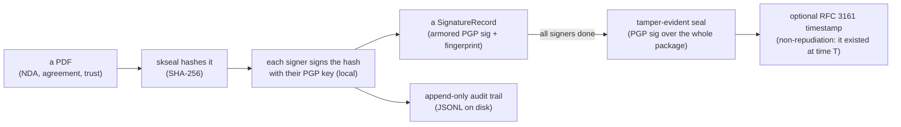
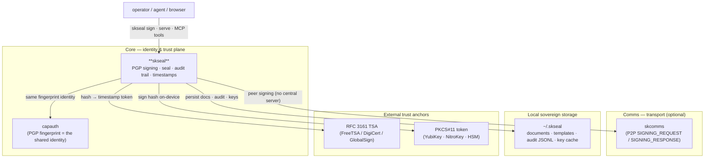
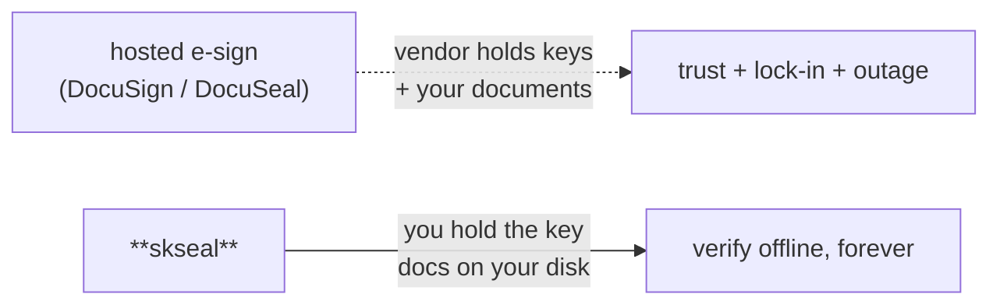

# skseal — Sovereign Document Signing 🐧

  

> **Your signature is your sovereign identity. No third party should hold the pen.**
> Sign PDFs with your own PGP key, verify them offline forever, and keep a
> tamper-evident audit trail — no DocuSign, no cloud, no account, no trust required.

skseal is the **document-signing capability** of the [SKWorld](https://skworld.io)
sovereign agent ecosystem. It replaces hosted e-signature platforms (DocuSign,
DocuSeal) with a model where **identity is a PGP fingerprint, not an email**, and
**keys never leave the signer's device**. The engine only ever touches *hashes* and
*signatures*; the legally binding artifact lives on your filesystem (Syncthing- and
git-friendly), not someone else's database.

---

## The 60-second version



A signature proves *who* signed *exactly these bytes* and *when*. Anyone holding the
signer's public key can verify it — offline, years later, with zero dependency on
skseal or any server.

## Quickstart

```bash
pip install skseal                       # or: pip install -e .  (into the ~/.skenv venv)

# Sign a PDF with your armored PGP private key
skseal sign contract.pdf --key private.asc --name "Chef"

# Verify every signature on a document (by document-id)
skseal verify <document-id> --pubkey chef.pub.asc

# List documents / filter by status
skseal list
skseal list --status pending

# Inspect the full audit trail
skseal audit <document-id>

# Available templates (NDA, operating agreement, trust declaration, …)
skseal templates

# Optional extras
pip install "skseal[timestamp]"          # RFC 3161 TSA support
pip install "skseal[pkcs11]"             # YubiKey / NitroKey / HSM support
pip install "skseal[all]"

# RFC 3161 timestamp (non-repudiation proof)
skseal timestamp stamp contract.pdf      # → writes contract.pdf.tsr
skseal timestamp verify contract.pdf

# Sign on a hardware token (key never leaves the device)
skseal token list
skseal token sign contract.pdf --name "Chef" --pin <PIN>

# Serve the REST API + browser signing UI
skseal serve --port 8400
```

### Python API

```python
from skseal.engine import SealEngine
from skseal.models import Document, Signer, DocumentStatus

engine = SealEngine()
pdf = open("contract.pdf", "rb").read()

signer = Signer(name="Chef", fingerprint="DEADBEEF...")
doc = Document(title="NDA", pdf_hash=engine.hash_bytes(pdf),
               signers=[signer], status=DocumentStatus.PENDING)

doc = engine.sign_document(
    document=doc, signer_id=signer.signer_id,
    private_key_armor=open("private.asc").read(),
    passphrase="hunter2", pdf_data=pdf,
)
print(doc.status)   # DocumentStatus.COMPLETED  (all signers signed)
```

## What skseal provides

| Piece | Module | What it is |
|---|---|---|
| **Signing engine** | `engine.py` | The stateless crypto core: SHA-256 hashing, PGP detached signing/verify, multi-signer workflow, and the tamper-evident **seal** over the whole package |
| **Data model** | `models.py` | `Document` · `Signer` · `SignatureRecord` · `AuditEntry` · `Template` — DocuSeal-compatible JSON (20 field types, normalized 0–1 placement) + sovereign extensions (PGP fields, fingerprint identity, roles incl. witness/notary/steward/trustee) |
| **Store** | `store.py` | Filesystem-backed CRUD under `~/.skseal/` — documents, templates, append-only JSONL audit logs, cached public keys. No database |
| **CLI** | `cli.py` | `skseal {sign,verify,list,templates,audit,serve,timestamp,token}` (click + rich) |
| **REST API** | `api.py` | FastAPI server (default port **8400**) — full template/document/sign/verify/seal/key/timestamp surface, mirrors DocuSeal REST conventions, serves the browser signing UI |
| **Browser client** | `web/` (`@skseal/web`) | Client-side signing with **OpenPGP.js** — keys generated and stored in browser IndexedDB, signing happens locally, only the signature reaches the server |
| **MCP server** | `mcp_server.py` | 17 MCP tools so any AI agent (Claude Code, Cursor, Claude Desktop…) can drive the full signing lifecycle |
| **P2P transport** | `skcomms_transport.py` | Request/response signing **over SKComms** — no central server in the signing flow; only hashes + signatures cross the wire |
| **RFC 3161 timestamps** | `timestamp.py` | TSA timestamping (FreeTSA default) for non-repudiation / eIDAS / ETSI archival |
| **Hardware tokens** | `pkcs11.py` | PKCS#11 signing on YubiKey / NitroKey / HSM — private key stays on-device |
| **Templates** | `templates/` | Ready-made: NDA, operating agreement, PMA membership, service agreement, trust declaration |

## Where it lives in SKStack v2

skseal is a **Core** capability — it's part of the sovereign identity/trust plane,
because a document signature *is* an identity assertion. It reuses the same **PGP
fingerprint identity** that `capauth` issues, persists everything through its own
filesystem store, and (optionally) moves signing requests over the **Comms** tier
via `skcomms`. None of these are hard runtime requirements except pgpy + pypdf — the
rest light up as you grow.



See **[docs/ARCHITECTURE.md](docs/ARCHITECTURE.md)** for the signing/verify/seal
lifecycle, the P2P sequence, and the full source map.

## Documentation

| Doc | Contents |
|---|---|
| **[Architecture](docs/ARCHITECTURE.md)** | Signing lifecycle, document state machine, P2P sequence, the seal, source map, where it lives (mermaids) |
| **[Hardware tokens](docs/HARDWARE_TOKENS.md)** | PKCS#11 setup for YubiKey / NitroKey / HSM |

## Why sovereign signing



The signature is a PGP detached signature over the document hash. The audit trail is
append-only JSONL. The seal is a deterministic, sorted-JSON digest signed by a sealing
key. Everything is a plain file you own — verifiable by `pgpy`, OpenPGP.js, GnuPG, or
OpenSSL, with or without skseal ever running again.

Part of the **[SKWorld](https://skworld.io)** sovereign ecosystem · site:
**[skseal.skworld.io](https://skseal.skworld.io)** · 🐧 smilinTux
</content>
</invoke>
