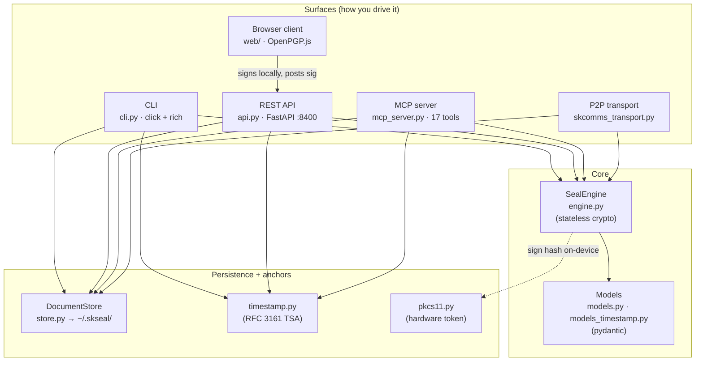
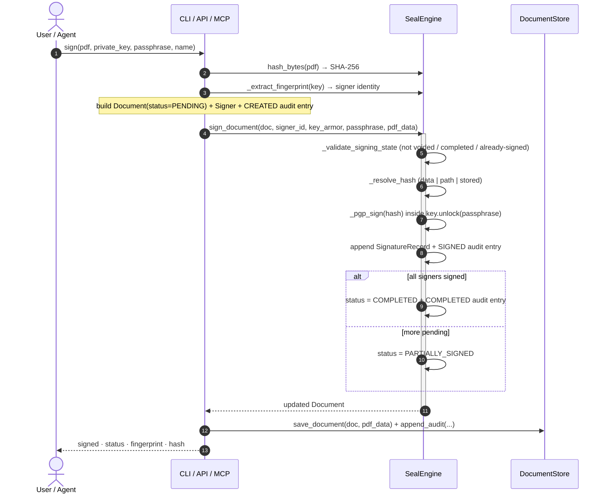
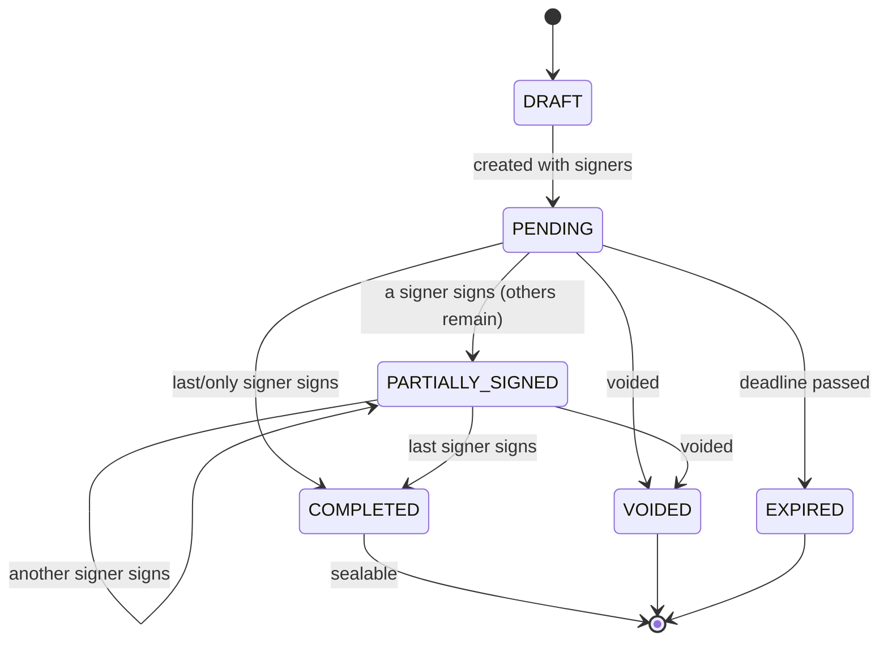
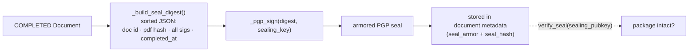
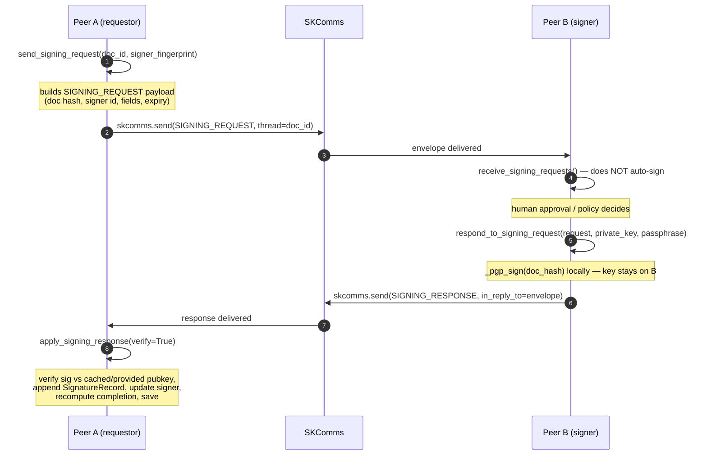
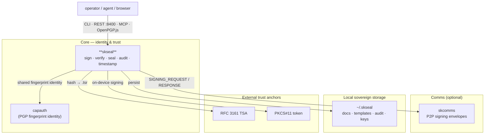

# skseal — Architecture

skseal is **sovereign document signing**: PGP-backed, legally binding, no middleman.
This document explains how it actually works — the signing lifecycle, the document
state machine, the peer-to-peer signing path, the tamper-evident seal, and where the
code lives.

The guiding constraints, all enforced in code:

1. **Keys never leave the signer's device.** The engine signs and verifies *hashes*.
   Private key material is passed in, used inside an `unlock()` context, and never
   persisted. (`engine.py: _pgp_sign`, hardware path: `pkcs11.py`.)
2. **Identity is a PGP fingerprint, not an email.** A `Signer` is identified by
   `fingerprint`; the Web of Trust *is* the identity layer — the same fingerprint
   identity `capauth` issues.
3. **State is plain files you own.** No database. Documents, templates, audit logs,
   and cached public keys live under `~/.skseal/` as JSON / JSONL / `.asc`
   (Syncthing- and git-friendly). (`store.py`.)
4. **The artifact is verifiable without skseal.** A `SignatureRecord` is a standard
   armored PGP signature over a SHA-256 hash; the seal is a deterministic sorted-JSON
   digest. Any OpenPGP implementation can verify them.

---

## Component overview



`SealEngine` is **stateless** — it takes a `Document` model in, performs crypto, and
returns the updated model. All persistence is the `DocumentStore`'s job. Every
surface (CLI, REST, MCP, P2P) is a thin adapter over the same engine + store.

---

## The signing lifecycle

A single signer flow (the `skseal sign` path) — hashing, local PGP signing, record +
audit, completion check:



**Verification** is the mirror image and needs no private key. The engine recomputes
the hash from the current PDF; if it differs from `record.document_hash` the document
was modified after signing → `INVALID`. Otherwise it checks the PGP signature against
the signer's public key (`engine.verify_signature` / `verify_document`, keyed by
fingerprint). Public keys are supplied on the CLI (`--pubkey`) or pulled from the
store's key cache.

---

## Document state machine

`DocumentStatus` transitions, driven by signer actions:



Completion is computed, not set: `Document.is_complete` is true when *every* signer's
status is `SIGNED`. The engine refuses to sign a `VOIDED` or already-`COMPLETED`
document, or a signer who has already `SIGNED` or `DECLINED`
(`engine._validate_signing_state`). Each signer carries its own `SignerStatus`
(`pending → viewed → signed | declined | expired`) and an `order` for sequential
signing.

---

## The seal — tamper-evidence over the whole package

Individual signatures prove each signer signed specific bytes. The **seal** proves
the *assembled package* (document hash + all signature records + completion time)
hasn't been altered. It is only available once the document is `COMPLETED`.



`_build_seal_digest` sorts signatures by `signed_at` and emits `sort_keys=True` JSON,
so the digest is **reproducible across platforms** — verification recomputes the same
bytes and checks the seal signature. (`engine.seal_document` / `verify_seal`.)

---

## Peer-to-peer signing (over SKComms)

When signers are on different machines, skseal moves the signing request and response
over **SKComms** — there is no central server in the signing flow, and only the hash
and resulting signature ever cross the wire. The transport uses dedicated SKComms
`MessageType.SIGNING_REQUEST` / `SIGNING_RESPONSE` envelopes so routers can separate
signing traffic from chat. (`skcomms_transport.py`, exposed as MCP tools.)



Idempotency: each request carries a `request_id`; applying a response for a signer
already `SIGNED` is ignored as a duplicate. `poll_and_apply_responses()` is the
convenience loop for the requestor side (cron / MCP tool).

---

## Source map

| Module | Role |
|---|---|
| `src/skseal/engine.py` | `SealEngine` — stateless crypto core: `hash_file/hash_bytes`, `sign_document`, `verify_signature/verify_document`, `seal_document/verify_seal`, `sign_document_pkcs11`, plus the `_pgp_sign/_pgp_verify/_extract_fingerprint/_build_seal_digest` helpers |
| `src/skseal/models.py` | Pydantic models — `Document`, `Signer`, `SignatureRecord`, `AuditEntry`, `Template` + `TemplateDocument/Submitter/Settings`, `DocumentField/FieldPlacement/Preferences/Validation`; enums `DocumentStatus`, `SignerStatus`, `SignerRole`, `AuditAction`, `FieldType`. DocuSeal-compatible JSON (20 field types, normalized 0–1 placement) + sovereign extensions (PGP fields, fingerprint identity) |
| `src/skseal/store.py` | `DocumentStore` — filesystem CRUD under `~/.skseal/`: documents (`document.json` + `source.pdf`), templates, append-only audit JSONL, cached public keys (`.asc`). No DB |
| `src/skseal/cli.py` | click + rich CLI — `sign`, `verify`, `list`, `templates`, `audit`, `serve`, and the `timestamp` / `token` command groups |
| `src/skseal/api.py` | FastAPI app (default `:8400`) — template/document CRUD, `sign`, `sign-client` (browser-signed), `verify`, `seal`, key register, timestamp endpoints, `/api/health`; serves the browser UI, mirrors DocuSeal REST conventions |
| `src/skseal/mcp_server.py` | MCP stdio server exposing 17 tools (list/create/sign/verify/seal/audit/store-key, timestamp ×3, hardware ×2, P2P ×4) for AI-agent orchestration |
| `src/skseal/skcomms_transport.py` | `SealSKCommsTransport` — P2P signing request/response over SKComms (`SIGNING_REQUEST` / `SIGNING_RESPONSE` envelopes) |
| `src/skseal/timestamp.py` | RFC 3161 TSA client (`rfc3161ng` primary, `cryptography`/`asn1crypto` fallback) → DER `.tsr` tokens; FreeTSA / DigiCert / GlobalSign defaults |
| `src/skseal/models_timestamp.py` | Pydantic models + enums for timestamp config, response, and verification status |
| `src/skseal/pkcs11.py` | PKCS#11 hardware-token signing — module discovery, `list_tokens`, `sign_with_token` (key stays on YubiKey / NitroKey / HSM) |
| `src/skseal/ui/` | Static browser signing UI (`sign.html`, `keygen.html`) served by the API |
| `web/` | `@skseal/web` TypeScript client — OpenPGP.js crypto, IndexedDB keystore, REST client, `SigningSession` orchestrator |
| `templates/` | Ready-made templates: NDA, operating agreement, PMA membership, service agreement, trust declaration |

### Storage layout (`~/.skseal/`)

```
~/.skseal/
├── templates/                 # reusable templates (JSON)
├── documents/
│   └── <doc-id>/
│       ├── document.json      # the Document model (signers, sigs, audit)
│       └── source.pdf         # the signed bytes
├── audit/
│   └── <doc-id>.jsonl         # append-only audit log
└── keys/
    └── <fingerprint>.asc      # cached public keys for verification
```

---

## Where it lives in SKStack v2

skseal is a **Core** capability — signing is an identity assertion, so it belongs in
the sovereign identity/trust plane next to `capauth` (with which it shares the **PGP
fingerprint** as the unit of identity). It optionally rides the **Comms** tier
(`skcomms`) for peer-to-peer signing, anchors to **external trust** (RFC 3161 TSAs,
PKCS#11 tokens), and persists to local sovereign storage. Hard runtime deps are just
`pgpy` + `pypdf`; everything else is opt-in.



Part of the **[SKWorld](https://skworld.io)** sovereign ecosystem · site:
**[skseal.skworld.io](https://skseal.skworld.io)** · 🐧 smilinTux
</content>
